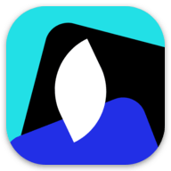
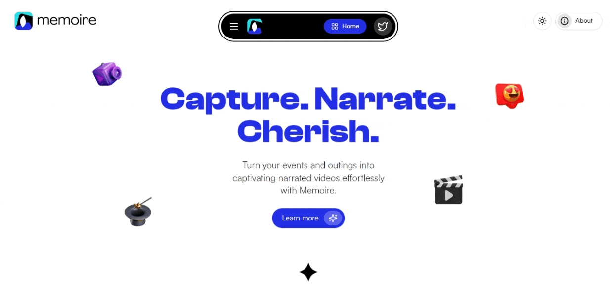
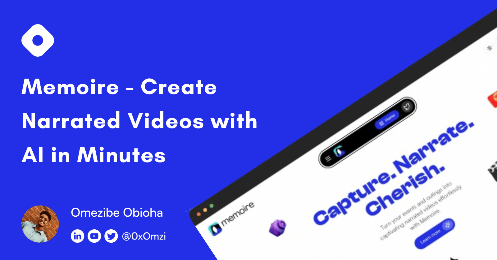

<p align="center" id="top">
	
	<p align="center">🧙🏽‍♂️ Create stunning narrated videos from your photos & videos using AI.</p>
</p>

<div align="center">


[](https://github.com/omzi/memoire/issues)
[](https://opensource.org/licenses/MIT)


</div>

<h4 align="center"><a href="https://memoire.omzi.dev"><i>Live Demo</i> 🚀</a></h4>



---

## 📜 **About**

Memoire is an AI-powered application designed to transform your photos and videos into compelling videos with ease. Learn more about Memoire in the article below:


> **Link**: *https://blog.omzi.dev/create-narrated-videos-with-ai-in-minutes-with-memoire*

## ⚙️ **Features**

- [x] Full-Featured Authentication
- [x] Upload Media & Generate Descriptions
- [x] Media Transitions
- [x] Sortable Media List
- [x] AI Script Generation
- [x] AI Audio Generation with Selectable Voices
- [x] Project Settings
- [x] Cloud Video Generation
- [ ] Canvas-Based, In-Browser Output Generation (WIP)
- [ ] AI Music Generation (WIP)
- [ ] AI Powered Subtitle Generation (WIP)

## 🛠 **Tech Stack**

- **_FrontEnd_**: TypeScript, Next.js, DND Kit
- **_BackEnd_**: Next.js API Routes, Server Actions, Prisma
- **_Styling_**: Tailwind CSS, shadcn/ui components
- **_Rate Limit_**: Upstash
- **_Authentication_**: Next Auth
- **_AI Models_**: AI71's Falcon 140B, Google's Gemini 1.5 Pro, OpenAI's TTS-1, Meta's Music Gen, OpenAI's Whisper
- **_Cloud Video Generation_**: StreamPot

## 🚩 **Prerequisites**

Ensure that your system meets the following requirements:

- [Node.js](https://nodejs.org/) version >= 20.15.0
- [npm](https://www.npmjs.com/) version >= 10.3.0

## ⚡ **Installation**

Before proceeding, make sure your system satisfies the prerequisites mentioned above. <br><br>
Firstly, clone the Memoire repository into your desired folder and navigate into it:

```shell
$ git clone https://github.com/omzi/memoire && cd memoire
```

Install the project dependencies using npm (or yarn if you prefer):

```shell
npm i
```

## ⚙ **Environment Variables**

Memoire requires certain environment variables to be set to function properly. Create a `.env` file in the root of your project and add the following variables:

```shell
NODE_ENV = # Your current environment
OPENAI_API_KEY = # Your OpenAI API key
GOOGLE_GENERATIVE_AI_API_KEY = # Your Google Generative AI API key
BREVO_API_KEY = # Your Brevo API key
SENDER_EMAIL = # Your sender email
SENDER_NAME = # Your sender name
DATABASE_URL = # Your database URL
NEXTAUTH_SECRET = # Your NextAuth secret
NEXTAUTH_URL = # Your NextAuth URL
EDGE_STORE_ACCESS_KEY = # Your Edge Store access key
EDGE_STORE_SECRET_KEY = # Your Edge Store secret key
UPSTASH_REDIS_REST_URL = # Your Upstash Redis REST URL
UPSTASH_REDIS_REST_TOKEN = # Your Upstash Redis REST token
STREAMPOT_API_KEY = # Your StreamPot API key
```

Once the environment variables are set, you can run Memoire locally with:

```shell
npm run dev
```

Visit the URL `http://localhost:3000/` in your browser to access the Memoire application.

## 👥 **Contributors**

- [Omezibe Obioha](https://github.com/omzi/) (@0xOmzi)

## 📄 **License**

This project is licensed under the MIT License. See the [`LICENSE`](./LICENSE) file for more details.

## ❌ **Disclaimer**

Memoire is a work-in-progress. You may experience intense rate limits, errors and/or bugs while testing out the application. Feel free to reach to me on Twitter ([@0xOmzi](https://twitter.com/0xOmzi)) regarding any issue you might be facing.

---

[Back To Top ↺](#top)

> Made with &#9829;